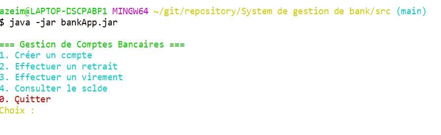

# Bank Account Management System
 ### Description
   This is a console-based Java 8 application for managing bank accounts (current and savings). It supports creating accounts, performing deposits, withdrawals, transfers, and viewing account balances and transaction history. Data persists in memory until the application closes.
## Technologies Used

Java 8
Java Time API (for operation dates)
Collections: ArrayList, HashMap
UUID for unique operation identifiers
Scanner for console input

## Project Structure

bank.model: Model classes (Compte, CompteCourant, CompteEpargne, Operation, Versement, Retrait)
bank.servic: Business logic (CompteService)
bank.valid: Utility functions (Validation)
bank.app: Console interface (Main)

## Prerequisites

JDK 8
Eclipse IDE (or any Java 8 compatible IDE)

Installation and Execution

Clone the GitHub repository:git clone <repository-url>

Open the project in Eclipse.
Compile and run the Main class in the bank.app package.

Generating and Running JAR

Compile the source files:  `javac bank/**/*.java`

Create the JAR file: `jar cfe BankApp.jar bank.app.Main bank/**/*.class`

Run the JAR: `java -jar BankApp.jar`

## Jira URL : 

https://azeimily2001-1757951624297.atlassian.net/jira/software/projects/DP/boards/1?atlOrigin=eyJpIjoiNjJkMTZkNTg0NzE1NDZkNDgzOWUwYmNkMzVmNjk2MWIiLCJwIjoiaiJ9

## Usage

Run the application to access an interactive console menu.
Choose options to create accounts, deposit, withdraw, transfer funds, or view balances and operations.
Account codes are automatically generated in the format CPT-XXXXX.
Input validation ensures positive amounts and correct code formats.

## Screenshots
  ### Class Diagram

 
 ### Menu :

